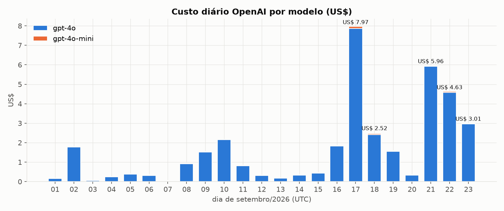
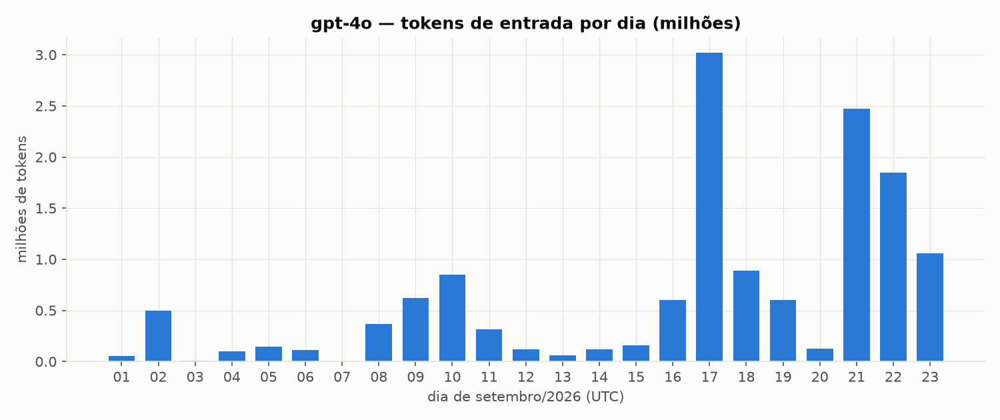
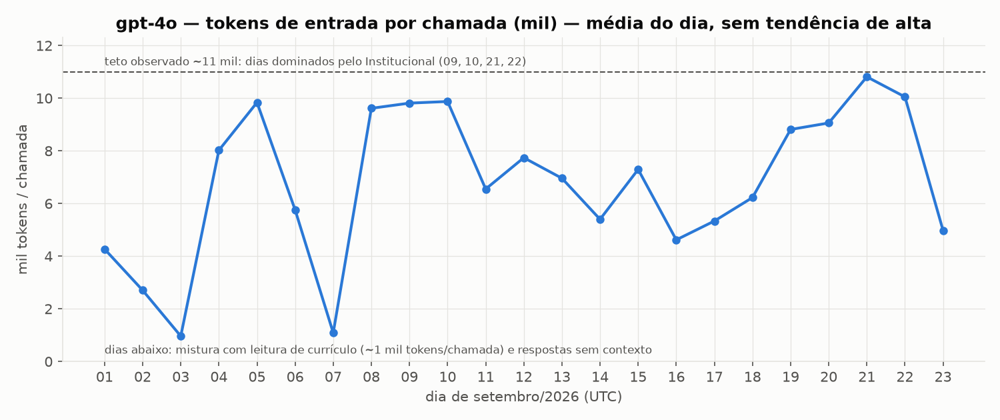
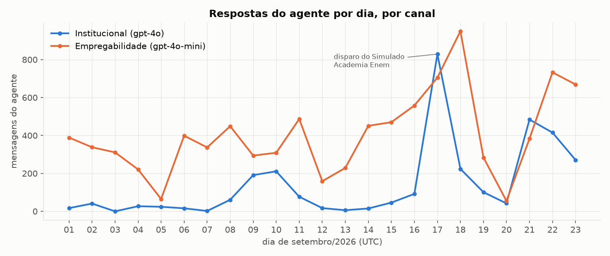
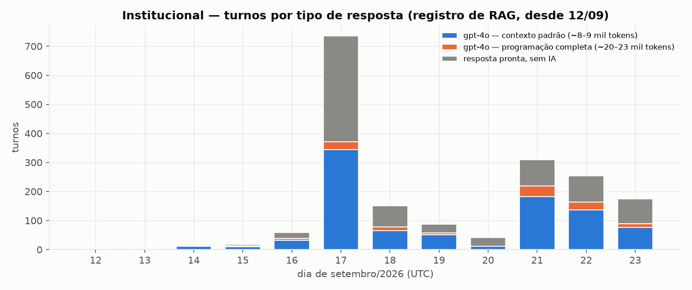
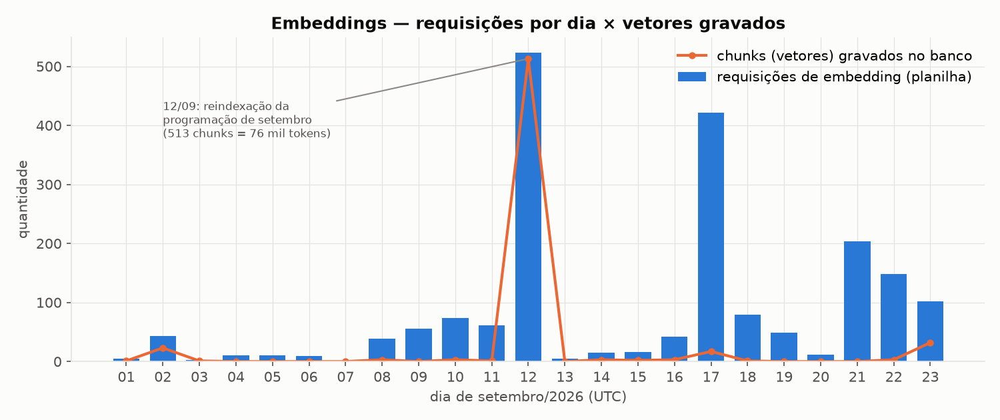
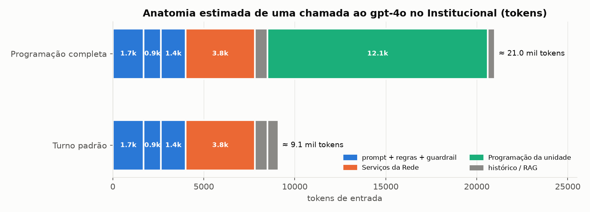
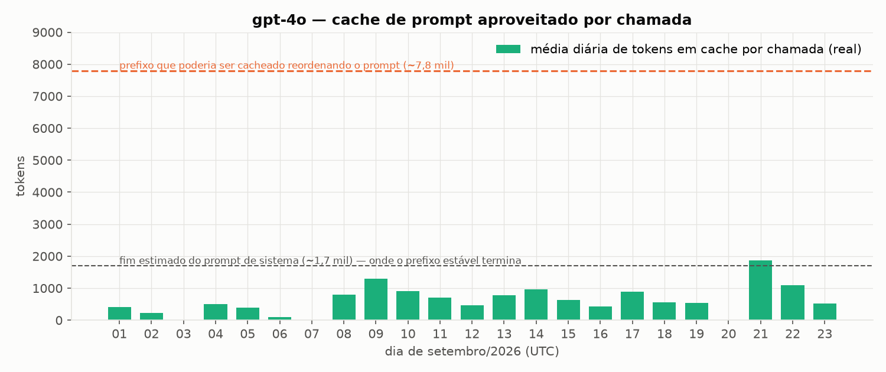

# Diagnóstico — Consumo OpenAI (01 a 23/09/2026)

**Data:** 23/09/2026 · **Fonte:** relatórios de uso da OpenAI (planilhas de *completions*, *cost*, *embeddings*, *images*) cruzados com o banco de **produção** (`cuca`, `svzkrkfzpiqcesloukgb`), o código do repositório, as versões publicadas das Edge Functions e os logs de execução.
**Escopo:** refeito do zero. Nenhum levantamento anterior foi usado como fonte.
**Documento irmão:** [PROGNOSTICO-consumo-openai-2026-09-23.md](PROGNOSTICO-consumo-openai-2026-09-23.md). Ele traz as projeções e o plano de redução.

---

## 1. Resumo executivo

| Pergunta | Resposta curta |
|---|---|
| Quanto foi gasto? | **US$ 37,89** entre 01 e 23/09 (fatura). O recálculo pelos tokens dá US$ 37,75 e bate. |
| Quando subiu? | Média de **US$ 0,71/dia** entre 01 e 13/09 e de **US$ 2,87/dia** entre 14 e 23/09, **4×** mais. Picos: 17/09 (US$ 7,97), 21/09 (US$ 5,96), 22/09 (US$ 4,63). |
| O que custa? | **gpt-4o = 98,2%** do gasto (US$ 37,07). gpt-4o-mini = 1,8% (US$ 0,68). Embeddings custaram praticamente zero: 114 mil tokens, cerca de US$ 0,002. Não houve uso de imagem. |
| Quem chama o gpt-4o? | Principalmente o **agente Institucional (motor-agente)**. O modelo ajustado explica 99,8% da variação diária do gpt-4o com três variáveis: turnos do Institucional com contexto padrão, turnos com programação completa e processamento de currículo. |
| Por que subiu? | Por **volume de conversas no Institucional**, não por aumento do custo de cada chamada. Cada resposta leva de 9 a 21 mil tokens de contexto fixo para o gpt-4o. Houve 3 ondas de volume: o **disparo do Simulado Academia Enem (17/09)** e duas ondas **orgânicas** de novos contatos (21 e 22/09). |
| Mudou algum código ou prompt que aumentou o custo por chamada entre 14/09 e 22/09? | **Nenhuma mudança de código elevou o custo por chamada.** O motor-agente não recebeu versão nova desde 12/09, e nenhum prompt de agente (`prompts_agentes`) foi alterado no período (o do Institucional é de 08/09). As mudanças **de conteúdo** no período foram: (1) edição do documento "Serviços da Rede" em 17/09, que entra em todo turno; o efeito estimado é de **no máximo cerca de 200 tokens por turno**, porque o tamanho anterior não ficou registrado; (2) FAQ e eventos do simulado (17/09), que só entram quando a busca os traz; (3) mudanças no worker (botão Quick Reply e porteiro da Academia Enem), que **alteraram o caminho das mensagens**, não o prompt (ver seção 6.1). O salto estrutural de peso por chamada foi **anterior**: a troca do "Serviços da Rede" da V1 (8,5 mil caracteres) para a V2 (15,8 mil) em **02/09**. |
| E a programação manual no portal? | **Hoje não gera consumo.** Outubro está em rascunho (451 atividades nas 5 unidades), a criação manual não chama OpenAI e nada foi indexado ainda. O impacto chega **na publicação**, pelo tamanho do texto que passa a ir para o gpt-4o (detalhes na seção 7). |
| Desperdício identificável? | Sim, em 4 pontos: (1) **186 cliques no botão "Sim, eu vou!"** do simulado foram respondidos pelo gpt-4o em vez de resposta pronta; (2) o **cache da OpenAI** aproveita em média só cerca de 0,8 mil tokens por chamada (maior média diária: 1,9 mil), quando poderia aproveitar cerca de 7,8 mil; (3) o documento "Serviços da Rede" entra **inteiro** em todo turno; (4) cada trecho da programação repete um **cabeçalho de 2 linhas**, cerca de 20% do texto. |
| Há telemetria de consumo? | **Não.** As tabelas `ai_usage_logs` (0 linhas) e `metricas_openai` (4 linhas antigas) não são alimentadas, embora a tela "Consumo" do módulo Developer diga que o registro é automático. |



---

## 2. As planilhas da OpenAI

### 2.1 Totais do período (01–23/09, dias em UTC)

| Modelo | Chamadas | Tokens de entrada | Em cache | Tokens de saída | Custo recalculado |
|---|---:|---:|---:|---:|---:|
| gpt-4o-2024-08-06 | 2.102 | 14.134.100 | 1.747.968 (12%) | 392.117 | **US$ 37,07** |
| gpt-4o-mini-2024-07-18 | 6.013 | 2.820.762 | 20.352 | 429.453 | US$ 0,68 |
| text-embedding-3-small | 1.926 | 114.014 | — | — | ≈ US$ 0,002 |
| gpt-6-astra / gpt-image-2.5-flare | 4 | 669 | — | 939 | desprezível |
| **Fatura (planilha cost)** | | | | | **US$ 37,89** |

Preços usados no recálculo, por milhão de tokens: gpt-4o US$ 2,50 de entrada, US$ 1,25 em cache e US$ 10,00 de saída; gpt-4o-mini US$ 0,15, US$ 0,075 e US$ 0,60. O recálculo bate com a fatura dia a dia. A diferença de US$ 0,14 vem de embeddings, transcrição de áudio (Whisper) e do outro projeto.

**Observações das planilhas:**
- O custo está quase todo numa única chave e num único projeto (`key_Tj6w…` / `proj_…NY7jWC`), que é a chave usada pelo worker e pelas Edge Functions.
- Uma segunda chave (`key_gFcQ…`) fez 29 chamadas pequenas de gpt-4o-mini, cerca de 230 tokens cada. O perfil bate com a extração de categorias ou com a análise de sentimento. Custo desprezível.
- Um **terceiro projeto** (`proj_…ZaFSeH`, chave `key_ZjAO…`) fez 4 chamadas em 18/09, com os modelos `gpt-6-astra` e `gpt-image-2.5-flare`. Esses modelos **não aparecem no código do Cuca**. **Pergunta em aberto:** quem usa esse projeto?
- A planilha de imagens (`images_usage`) está vazia no período inteiro. A leitura de currículo por imagem é cobrada dentro dos tokens do gpt-4o, e não como "imagem".

### 2.2 O que o gráfico mostra



- O gpt-4o sai de dezenas ou centenas de milhares de tokens por dia para **3,0 milhões em 17/09**, **2,5 milhões em 21/09** e **1,8 milhão em 22/09**.
- A média de tokens **por chamada** não tem tendência de alta. Ela oscila entre 1 e 11 mil conforme a mistura do dia: currículo pesa cerca de 1 mil tokens e o Institucional de 9 a 21 mil. Os dias dominados pelo Institucional (09, 10, 21 e 22/09) ficam todos no teto de cerca de 10–11 mil. **Conclusão: subiu a quantidade de chamadas pesadas, não o peso de cada uma.**



---

## 3. Quem consome — mapa do código

Todos os pontos do sistema que chamam a OpenAI, rastreados no código:

| Onde | Modelo | O que faz | Peso por chamada | Peso no período |
|---|---|---|---|---|
| `supabase/functions/motor-agente` (Institucional) | **gpt-4o** | Responde o cidadão sobre programação, serviços e eventos | **9 mil tokens (padrão) a 21 mil (programação completa)** | **≈ 90% do gpt-4o** |
| `motor-agente` (avaliar seleção de unidade) | gpt-4o-mini | Classifica a unidade escolhida (até 90 tokens de saída) | pequeno | parte do mini |
| `motor-agente` / `processar-documento` / `academia-enem-*` | text-embedding-3-small | Busca vetorial e indexação | até 200 tokens por busca | ≈ US$ 0 |
| `worker/cv_processor.py` | **gpt-4o** (texto e visão) | Lê o currículo da candidatura ou do banco de talentos | ≈ 1 mil tokens por evento (estimado pelo resíduo) | ≈ 5–10% do gpt-4o (teto) |
| `worker/talent_bank_matcher.py` | **gpt-4o** | Ranqueia candidatos do banco de talentos para uma vaga (lotes) | variável | incluído no item acima (sem contador próprio) |
| `worker/empregabilidade_engine.py`, `intencao_detector.py`, `sentiment_processor.py`, `category_extractor.py`, `main.py` | gpt-4o-mini | Empregabilidade conversacional, intenção, sentimento, categorias | ≈ 470 tokens | **US$ 0,68 no total** |
| `worker/meta_adapter_inbound.py` | whisper-1 | Transcreve áudio | — | desprezível |
| `supabase/functions/academia-enem-agente` | gpt-4o | Agente próprio da Academia Enem | — | desprezível: 19 mensagens no total em `ae_mensagens`, 2 chamadas nas últimas 24h |
| `supabase/functions/gerar-resumo-rede` | gpt-4o | Gera o resumo da rede | — | **não rodou no período** (o resumo ativo é de julho) |
| `cuca-portal/.../developer/batch-triage` | gpt-4o / mini | Triagem em lote (tela Developer) | — | uso manual, sem sinal nas planilhas |

**Empregabilidade:** apesar de ser o canal com **mais mensagens** (até 950 respostas por dia), ela usa **gpt-4o-mini** com cerca de 470 tokens por chamada. Por isso custou **menos de 2%** do total. O custo **não** está no volume de mensagens em geral, e sim no **volume do Institucional** combinado com o **peso do contexto dele**.



---

## 4. Cruzamento planilha × banco (a prova)

### 4.1 Modelo de decomposição

O banco tem, desde 12/09, a tabela `rag_retrieval_logs`: **uma linha por turno** do Institucional, que registra o tipo de resposta (camada). Com ela dá para separar os turnos em três grupos:

- **Sem IA** (resposta pronta, encerramento, transbordo): não chamam o gpt-4o.
- **gpt-4o com contexto padrão** (busca vetorial, busca determinística, sem resultado, sem contexto).
- **gpt-4o com programação completa da unidade** (carrega todos os trechos do mês).



Aplicando o peso medido de cada tipo (seção 5), a estimativa diária fica muito próxima do real:

| Dia | Turnos gpt-4o padrão | Turnos com programação completa | Tokens estimados (9 mil / 22 mil) | Tokens reais gpt-4o (planilha) | Diferença |
|---|---:|---:|---:|---:|---:|
| 19/09 | 51 | 6 | 591 mil | 599 mil | +1% |
| 20/09 | 11 | 1 | 121 mil | 127 mil | +5% |
| 21/09 | 182 | 37 | 2,45 mi | 2,48 mi | +1% |
| 22/09 | 137 | 26 | 1,81 mi | 1,85 mi | +2% |
| 23/09 (parcial) | 76 | 13 | 0,97 mi | 1,06 mi | +9%, dia com 186 eventos de currículo |

Uma regressão linear nos 12 dias com registro (12 a 23/09) explica **99,8%** da variação diária do gpt-4o. Ela serve só como checagem de consistência: os coeficientes variam conforme a especificação, e os valores de referência são os da medição direta da seção 5.

### 4.2 Contraprovas independentes

- **Embeddings × vetores:** o número de requisições de embedding por dia bate com as buscas vetoriais do Institucional somadas aos trechos gravados no banco. Em 21/09 foram 203 requisições contra 197 turnos com busca. Em 12/09 foram 523 requisições contra 513 trechos reindexados mais cerca de 10 buscas.
- **Logs das Edge Functions (últimas 24h):** o motor-agente foi chamado **188 vezes** (180 com status 200 e 8 com status 500, média de 4,0 s), contra **187 turnos** registrados. A relação é 1 para 1: **não há chamada duplicada** por reenvio ou timeout do worker.
- **Versões publicadas:** o motor-agente está na **v57**, publicada em 12/09 (04:51 UTC). O `processar-documento` está na v10, de 12/09. O `gerar-resumo-rede` está na v3, de 13/09, e não foi executado desde então. **Nenhuma** Edge Function que consome a OpenAI mudou entre 14 e 23/09.



---

## 5. Por que cada resposta do Institucional é cara — anatomia do prompt

Medido no banco e no código, com contagem de tokens feita pelo tokenizador do gpt-4o (`o200k_base`) sobre amostras reais:

| Bloco (entra em **todo** turno com IA) | Tamanho | Tokens (aprox.) |
|---|---:|---:|
| Prompt de sistema do Institucional (`prompts_agentes.prompt_sistema`) | 7.274 caracteres | ≈ 1.700 |
| Regras técnicas (`prompt_contexto`) | 4.017 caracteres | ≈ 950 |
| Guardrail de segurança (fixo no código) | 5.091 caracteres | 1.352 (medido) |
| **Documento "Serviços da Rede" V2, inteiro** | **15.778 caracteres** | **≈ 3.800** |
| Histórico (10 mensagens), data/hora, nome, instruções | — | ≈ 700 |
| **Subtotal fixo por turno** | | **≈ 8.500** |
| + trechos da busca vetorial (3 a 5) | ≈ 400 caracteres cada | ≈ 600 → **≈ 9.100** |
| **ou** + **programação completa da unidade** | 34 a 45 mil caracteres | ≈ 10.500 a 13.900 → **≈ 21.000** |



**Custo por turno hoje:** cerca de **US$ 0,023** no turno padrão e cerca de **US$ 0,053** no turno com programação completa. Com 219 turnos (21/09) isso dá cerca de US$ 6 por dia.

### 5.1 Três agravantes estruturais

1. **"Serviços da Rede" vai inteiro em todo turno.** Em 02/09 o documento passou da V1 (8.519 caracteres) para a V2 (15.778), o que somou cerca de **1.800 tokens a toda resposta**, cerca de 25% a mais no turno padrão. Ele foi editado de novo em 17/09 às 15:18 UTC. O documento já está dividido em 22 trechos com vetores no banco, mas o motor-agente não usa esses trechos: carrega o texto completo.
2. **O cache da OpenAI é quase desperdiçado.** A OpenAI dá 50% de desconto nos tokens iniciais repetidos entre chamadas. Hoje o prompt é montado na ordem: sistema, **data e hora** (muda a cada minuto), guardrail, regras, serviços. A data logo no início quebra o prefixo repetido. Nos dados, o cache fica em **0,8 mil tokens por chamada na média do período**, e a **maior média diária é 1,9 mil** (21/09). Isso é compatível com o prefixo estável terminar no fim do prompt de sistema (estimado em cerca de 1,7 mil tokens). Chamadas no mesmo minuto compartilham a mesma linha de data e podem aproveitar mais, mas isso é a exceção. Nos dias de pouco movimento o cache quase não acontece, porque ele expira após alguns minutos sem chamadas. Se os blocos fixos (cerca de 7,8 mil tokens) viessem antes da data, quase todo o contexto fixo seria cobrado pela metade.
3. **Cada trecho da programação repete um cabeçalho de 2 linhas.** Desde a reindexação de 12/09 existe **um trecho por atividade**, e cada um começa com "PROGRAMAÇÃO MENSAL (9/2026) - Cuca X / Título: Programação Mensal - 9/2026". São **41,0 mil caracteres de cabeçalho repetido** nas 5 unidades, cerca de **21% do texto** que vai no turno de programação completa. Em agosto eram cerca de 45 trechos maiores por unidade, sem essa repetição.



---

## 6. Os eventos do período, rastreados

### 6.1 17/09 — Disparo do Simulado Academia Enem (programação pontual)

| Fato (banco) | Valor |
|---|---|
| Disparo | Evento pontual "SIMULADO ACADEMIA ENEM 2026", enviado pelo número **Institucional** entre 15:44 e 17:38 UTC |
| Envios registrados | 624 (569 com status de sucesso), mais 9 envios em 4 disparos menores ao longo do dia |
| Conversas novas no Institucional | **456** no dia (média anterior: cerca de 10/dia), 198 delas com marca de disparo recente |
| Confirmações anotadas (`confirmacoes_simulado_ae`) | 441 no total: 417 por botão (380 "confirmou" e 37 "não vai") e 24 por texto |
| Respostas do agente no dia | 829 |
| Custo do dia | **US$ 7,97**, o maior do mês |

**Achado — cliques de botão caindo no gpt-4o:** o texto "Sim, eu vou!" (o botão de confirmação) aparece **228 vezes** como resposta pronta e **186 vezes** como turno do **gpt-4o** sem contexto (camada `nao_aplicavel`). A causa está no código do motor-agente (`index.ts`, trecho do log "Disparo recente não reconhecido (aguardando_unidade) — ignora resposta canned, segue pro GPT"): **quando a conversa tem a marca de disparo recente, o motor pula a resposta pronta e chama o gpt-4o**. O porteiro da Academia Enem no worker **anota** a confirmação, mas só responde com texto fixo as perguntas de **horário**. O clique de confirmação segue para o motor-agente.
- Custo desses 186 turnos: cerca de 5 mil tokens cada, **cerca de US$ 2,4**, 31% do dia.
- **Causa confirmada no banco:** todos os 187 turnos "Sim, eu vou!" que foram ao gpt-4o estão em conversas com a marca de disparo recente (`conversas.metadata.ultimo_disparo`).
- O restante do dia são dúvidas reais: 126 buscas vetoriais, 26 turnos de programação completa, 30 sem resultado e 6 determinísticos.

**Lembrete:** o simulado de **27/09** vai repetir esse padrão se houver novo disparo ou lembrete com botão.

### 6.2 21 e 22/09 — onda orgânica

| Fato | 21/09 | 22/09 | 23/09 (parcial) |
|---|---:|---:|---:|
| Conversas novas no Institucional | 70 | 54 | 42 |
| Conversas com marca de disparo | 1 | 1 | 0 |
| Primeiras mensagens mais comuns | "boa tarde", "oi", "bom dia" | idem | idem |
| Turnos com gpt-4o (padrão + programação completa) | 182 + 37 | 137 + 26 | 76 + 13 |
| Conversas com 15 ou mais respostas do agente | 6 | 7 | 3 |
| Custo | US$ 5,96 | US$ 4,63 | US$ 3,01 |

**Não houve disparo.** São **pessoas novas** puxando conversa, **5 a 7 vezes** a média orgânica anterior, com conversas longas sobre programação. O motivo da procura **não está no banco**: pode ser divulgação do número, redes sociais, abertura de inscrições ou o simulado de 20/09. **Pergunta em aberto para o Junior.**

### 6.3 12/09 — reindexação da programação de setembro

Os **513 trechos** da programação de setembro foram regravados (um por atividade) e geraram **523 requisições e 76 mil tokens de embedding**, o maior pico de embeddings do mês. **Custo: menos de US$ 0,002.** O efeito relevante não foi o embedding em si. Foi o formato novo dos trechos, que agora têm cabeçalho repetido (seção 5.1).

### 6.4 Linha do tempo das mudanças (14/09 → 22/09)

| Data (UTC) | Mudança | Afeta o consumo OpenAI? |
|---|---|---|
| 02/09 | "Serviços da Rede" V1 → V2 (8,5 mil → 15,8 mil caracteres) | **Sim**: +≈1,8 mil tokens em **todo** turno do Institucional |
| 08/09 | Última edição do prompt do Institucional | Não entra no período |
| 12/09 | motor-agente v57, processar-documento v10, reindexação de 513 trechos, criação do registro por turno (`rag_retrieval_logs`) | Sim, no formato dos trechos (cabeçalho repetido) |
| 13/09 | Permissões de programação e programação pontual; gerar-resumo-rede v3 | Não (a função não rodou) |
| 15/09 | Worker: lista de vagas acima de 4.096 caracteres (Empregabilidade) | Não relevante (gpt-4o-mini) |
| 16/09 | Worker: entende resposta de botão (Quick Reply) | **Sim, indiretamente**: o clique vira texto "Sim, eu vou!" e segue para o motor |
| 17/09 | Worker: porteiro anota confirmação e responde horário; FAQ e eventos do simulado indexados; edição de "Serviços da Rede" às 15:18 UTC | Porteiro **reduz** chamadas (horário); o clique de confirmação continua indo ao gpt-4o; a edição do "Serviços da Rede" soma no máximo cerca de 200 tokens por turno (estimativa: o tamanho anterior não foi registrado; a proporção entre trechos e documento indica uma versão de cerca de 14,9 mil caracteres antes) |
| 21–22/09 | Portal: criação manual da programação, rascunho, exclusão por categoria; CI | **Não** (nenhuma chamada à OpenAI; ver seção 7) |

---

## 7. Programação inserida manualmente no portal

| Fato (banco) | Setembro (importado por planilha) | Outubro (manual, em andamento) |
|---|---:|---:|
| Status | aprovado (publicado) | **rascunho** nas 5 unidades |
| Atividades | 513 | 451 (42 em 22/09 e 409 em 23/09) |
| Texto médio por atividade (título + descrição + dados) | 522 caracteres | **620 caracteres (+19%)** |
| Texto total | 267,7 mil | 279,8 mil (+4,5%) |
| Trechos/vetores gerados | 513 | **0** (nada indexado ainda) |

**Impacto hoje: zero.** Rastreamento no código:
- As rotas do portal em `cuca-portal/src/app/api/programacao/*` (rascunho, status, importar, pontual, excluir) **não chamam a OpenAI**.
- A **importação por planilha** chama `/extract-categories` no worker (gpt-4o-mini, centavos).
- A **criação manual não chama** nenhum serviço de IA.
- A indexação (embeddings) só acontece na **publicação** (aprovação), via gatilho que chama `processar-documento`.

**Impacto na publicação:**
- **Embeddings:** 451 trechos, cerca de 80 mil tokens, **menos de US$ 0,002**. Irrelevante.
- **Peso do turno "programação completa":** a quantidade de atividades é menor, mas o texto por atividade é mais longo. O resultado é cerca de **+5% de tokens** nesse tipo de turno, mais o cabeçalho repetido (451 trechos × cerca de 80 caracteres, cerca de 36 mil caracteres).
- **O fator dominante continua sendo o volume de conversas.** A publicação costuma vir acompanhada de **divulgação** (disparo), que traz a onda de conversas.

---

## 8. Base vetorial — saúde

| Item | Situação |
|---|---|
| Trechos sem vetor | 0 |
| Trechos ativos (usados na busca) | 641 |
| Trechos de documentos **inativos** ainda armazenados | 854 (não custam OpenAI; só ocupam espaço) |
| Eventos pontuais ativos **duplicados** | "Corrida da Juventude" ×4 (evento de julho, **passado**), "Conexão Futuro CUCA Barra" ×3 (de março e abril, **passado**; um deles sem trechos) |
| Simulado Academia Enem | 2 documentos de evento ativos + 1 FAQ de horários (17/09) |
| Vagas (`job_posting`) ativas | 49 documentos, contra cerca de 30 vagas abertas: documentos de vagas encerradas continuam na busca |
| Resumo da rede | ativo desde 13/07 (julho), **desatualizado** |

Eventos passados e vagas encerradas ainda ativos **não aumentam o custo** de forma relevante, porque a busca vetorial traz no máximo 3 a 5 trechos. Eles aumentam, porém, o **risco de resposta errada**: o agente pode divulgar evento ou vaga que já acabou, o que gera mais perguntas e mais turnos.

---

## 9. Telemetria — o ponto cego

- A tabela `ai_usage_logs` tem **0 linhas**. A tela **Developer → Consumo** do portal lê essa tabela e afirma que "o registro automático acontece a cada chamada ao motor-agente". **Isso não está acontecendo.**
- A tabela `metricas_openai` tem **4 linhas** antigas.
- A OpenAI devolve em cada resposta o total de tokens usados (`usage`), mas **nenhum** ponto do código grava esse dado.
- **Consequência:** este diagnóstico precisou reconstruir o consumo cruzando a planilha com tabelas indiretas. A separação exata entre currículos e banco de talentos só pode ser dada como **teto estimado** (cerca de 5–10% do gpt-4o).

---

## 10. Conclusões

1. **Causa principal:** o volume de conversas no **Institucional** (gpt-4o) triplicou ou quadruplicou em três ondas: disparo do simulado em 17/09 e ondas orgânicas em 21 e 22/09. Cada resposta com IA custa de US$ 0,02 a US$ 0,05 por causa do contexto fixo pesado.
2. **Não houve regressão de código entre 14 e 22/09** que aumentasse o custo por chamada. O aumento estrutural de peso por chamada veio da **V2 de "Serviços da Rede" (02/09)**.
3. **Desperdício evitável confirmado:** 186 cliques de botão respondidos pelo gpt-4o; cache da OpenAI aproveitando 10–25% do que poderia; "Serviços da Rede" inteiro em todo turno; cabeçalho repetido nos trechos da programação.
4. **Academia Enem:** o agente próprio da Academia Enem quase não consome. O custo da Academia Enem veio do **disparo feito pelo número Institucional**, que jogou cerca de 450 conversas no motor-agente.
5. **Programação manual:** sem impacto até a publicação; depois, impacto pequeno (+5% no turno de programação completa). O risco real é a **divulgação** que acompanha a publicação.
6. **Empregabilidade, banco de talentos, embeddings, imagens:** não explicam o aumento.
7. **Não existe telemetria de consumo** no sistema, e a tela que diz existir está vazia.

---

## Apêndice A — Método e ressalvas

- **Fuso:** todos os dias estão em **UTC**, para casar com as planilhas da OpenAI. Em Fortaleza (UTC−3), parte da noite cai no dia seguinte da tabela.
- **23/09 é parcial:** planilha exportada à tarde, banco consultado às 21:31 UTC.
- **Tokens por bloco:** medidos com `tiktoken`/`o200k_base` sobre amostras reais (programação: 3,24 caracteres por token; texto corrido: cerca de 4,3). O guardrail foi medido inteiro (1.352 tokens).
- **Currículos e banco de talentos:** não há contador de chamadas. O valor é o **resíduo** do modelo (cerca de 0,8–1 mil tokens por evento de leitura) e deve ser lido como teto.
- **`rag_retrieval_logs`** só existe a partir de 12/09. Antes disso, a leitura usa mensagens e conversas.
- Todas as consultas ao banco foram **somente leitura**.

## Apêndice B — Consultas principais (reproduzíveis)

```sql
-- mensagens por dia (UTC) e canal
select (m.created_at at time zone 'UTC')::date d, c.agente_tipo,
       count(*) filter (where m.remetente='agente') resp, count(*) filter (where m.remetente='lead') lead
from mensagens m join conversas c on c.id=m.conversa_id
where m.created_at >= '2026-09-01' group by 1,2 order by 1,2;

-- turnos do Institucional por camada (1 linha por turno)
select (created_at at time zone 'UTC')::date d, camada, count(*)
from rag_retrieval_logs where created_at >= '2026-09-01' group by 1,2 order by 1,2;

-- tamanho do contexto: documentos ativos e seus trechos
select d.tipo, d.unidade_cuca, length(d.conteudo) len_doc, count(c.id) chunks, sum(length(c.conteudo)) len_chunks
from documentos_rag d left join chunks_documentos c on c.documento_id=d.id
where d.ativo group by d.id order by d.tipo;

-- cliques de botão que foram ao GPT
select camada, lower(left(mensagem_lead,30)) msg, count(*)
from rag_retrieval_logs where mensagem_lead ilike 'sim, eu vou%' group by 1,2;

-- disparos do período
select disparo_id, min(created_at), max(created_at), count(*) from logs_disparo
where created_at >= '2026-09-01' group by 1;

-- programação: setembro x outubro
select c.mes, c.status, count(a.*), round(avg(length(coalesce(a.titulo,''))+length(coalesce(a.descricao,''))+length(coalesce(a.metadata::text,''))))
from campanhas_mensais c join atividades_mensais a on a.campanha_id=c.id
where c.ano=2026 and c.mes in (9,10) group by 1,2;
```

Séries diárias consolidadas: [`dados/serie_diaria_consolidada.csv`](dados/serie_diaria_consolidada.csv).
