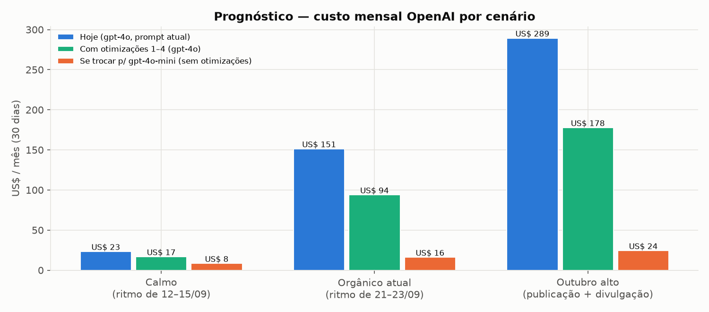

# Prognóstico — Consumo OpenAI (outubro/2026 em diante)

**Data:** 23/09/2026 · **Base:** [DIAGNOSTICO-consumo-openai-2026-09-23.md](DIAGNOSTICO-consumo-openai-2026-09-23.md). Todas as premissas vêm dos números medidos lá.
**Natureza:** projeção e plano de ação. **Nada aqui foi implementado.** Cada medida precisa de aprovação antes de virar tarefa.

---

## 1. Resumo

- **No ritmo atual** (ondas orgânicas como a de 21–23/09), o custo vai para cerca de **US$ 150/mês**. No período de 01 a 13/09 ele estava em cerca de **US$ 21/mês**.
- **Outubro tende a ser mais caro:** publicação da programação, divulgação e o simulado de 27/09. Num cenário alto, o custo chega a cerca de **US$ 290/mês**.
- **Quatro medidas de engenharia** que não mudam o modelo nem o comportamento visível do agente (seção 4) derrubam o custo em **35–40%**: cerca de US$ 94/mês no ritmo atual e cerca de US$ 178/mês no cenário alto.
- **Trocar o Institucional para gpt-4o-mini** derruba cerca de **90%**, mas é uma **decisão de produto e qualidade**. Exige teste comparativo antes (seção 5).
- **A programação manual não é o motor do custo.** O que pesa é o **volume de conversas** multiplicado pelo **tamanho do contexto** de cada resposta.

---

## 2. Premissas (medidas no diagnóstico)

| Premissa | Valor | Origem |
|---|---:|---|
| Custo de um turno padrão do Institucional (gpt-4o) | US$ 0,0235 (≈ 9,1 mil tokens de entrada, 0,8 mil em cache, 170 de saída) | seção 5 do diagnóstico |
| Custo de um turno com programação completa | US$ 0,053 (≈ 21 mil tokens) | idem |
| Custo de um turno sem contexto (ex.: clique de botão) | US$ 0,013 (≈ 5 mil tokens) | idem |
| Fração de turnos com programação completa | 10–20% | `rag_retrieval_logs`, 12–23/09 |
| Acerto de cache após reordenar o prompt (Medidas 1 e 2) | 70% das chamadas | **suposição**: depende de chamadas próximas no tempo; conferir na planilha após o deploy |
| Custo fixo diário (currículos, gpt-4o-mini, embeddings) | ≈ US$ 0,25/dia | média observada fora dos picos |
| Disparo com botão (tipo simulado, cerca de 620 envios) | 162 turnos padrão + 26 com programação + 183 de clique | 17/09 |
| Disparo de divulgação de programação (cerca de 500 envios) | ≈ 300 turnos, 30% com programação completa | **suposição**: não há disparo de programação em setembro para medir |

**Sensibilidade:** o custo é linear no número de turnos com IA. Cada **100 turnos a mais por dia** somam cerca de **US$ 80/mês** no formato de hoje, ou cerca de US$ 50/mês com as otimizações.

---

## 3. Cenários (30 dias)

| Cenário | Turnos com IA/dia | % programação completa | Eventos | **Hoje** | **Com medidas 1–4** | Com gpt-4o-mini (sem as medidas) |
|---|---:|---:|---|---:|---:|---:|
| **Calmo** (ritmo de 12–15/09) | 20 | 10% | — | US$ 23 | US$ 17 | US$ 8 |
| **Orgânico atual** (ritmo de 21–23/09) | 170 | 16% | — | **US$ 151** | **US$ 94** | US$ 16 |
| **Outubro alto** (publicação + divulgação + simulado) | 300 | 20% | 1 disparo com botão + 1 disparo de programação | **US$ 289** | **US$ 178** | US$ 24 |

**Eventos pontuais, custo por ocorrência (hoje → com medidas):**
- Disparo com botão igual ao de 17/09: cerca de **US$ 7,2 → US$ 3,1**.
- Publicação da programação de outubro, só o embedding de 451 trechos: **menos de US$ 0,002** (irrelevante).
- Turno com programação completa após a publicação de outubro: **cerca de +5% de tokens** por turno, porque o texto por atividade é 19% maior e há menos atividades. O efeito no total é pequeno.

**Quanto cada medida economiza no ritmo orgânico atual (US$ 151/mês):**

| Medida | Economia estimada/mês |
|---|---:|
| 1. Reordenar o prompt para o cache da OpenAI | ≈ US$ 31 |
| 2. "Serviços da Rede" por busca, e não inteiro | ≈ US$ 38 |
| 3. Remover o cabeçalho repetido dos trechos da programação | ≈ US$ 5 |
| 4. Clique de botão de disparo sem IA | ≈ US$ 2,4 **por disparo** com botão |
| 1+2+3 combinadas (não é a soma simples: o cache incide sobre o prefixo menor) | ≈ US$ 57 |
| 5. (decisão) trocar para gpt-4o-mini | ≈ US$ 135 |
| 6. Telemetria | não economiza; é o que permite **medir** as outras |

---

## 4. Recomendações de engenharia — com análise de impacto por item

> Para cada item: **o que toca**, **quem consome esse caminho hoje**, **impacto observável**, **como reduzir o risco antes** e **pergunta em aberto** (quando houver).

### Medida 1 — Reordenar o prompt para aproveitar o cache da OpenAI

- **Toca:** `supabase/functions/motor-agente/index.ts`, montagem do `promptFinal` (passo 10). Hoje a ordem é sistema → **data/hora** → guardrail → regras → disparo → contexto. A proposta é: sistema → guardrail → regras → Serviços da Rede (os blocos fixos, iguais em toda chamada) → e **só depois** data/hora, disparo, programação, unidade e instruções condicionais.
- **Quem consome hoje:**
  - O próprio gpt-4o, que recebe o texto.
  - O worker (`meta_adapter_inbound._chamar_motor_agente`), que só lê a resposta.
  - Os testes `index.test.ts` e `index.audit.test.ts`, que verificam trechos do prompt. É preciso checar se algum deles depende da **posição** e não só da presença do trecho.
- **Impacto observável:**
  - Para o cidadão, nenhum esperado: o conteúdo é o mesmo, só muda a ordem.
  - **Risco real:** modelos dão mais peso ao que vem no início e no fim do prompt. Mover a data para depois dos blocos fixos pode mudar levemente como o agente usa "hoje" (por exemplo, regra de mês anterior ou vigência do mês). A diretiva de vigência já é calculada à parte (passo 6.5), o que reduz esse risco.
  - Custo: cerca de −20% no ritmo atual.
- **Como reduzir o risco:**
  - Rodar a suíte de testes do motor-agente.
  - Comparar respostas antes e depois num conjunto fixo de perguntas reais tiradas de `rag_retrieval_logs.mensagem_lead`: programação, horário, mês anterior, pergunta geral.
  - Depois do deploy, conferir na planilha da OpenAI se `input_cached_tokens` por chamada sobe de cerca de 0,8 mil para 4–7 mil.
- **Pergunta em aberto:** nenhuma de produto.

### Medida 2 — "Serviços da Rede" por busca, e não o documento inteiro em todo turno

- **Toca:**
  - `motor-agente/index.ts`: `carregarServicosRede` e a variável `contextServicos`, hoje somada a todo contexto de agente de programação.
  - Troca por busca vetorial nos **22 trechos que já existem** no banco para o documento `servicos_rede` (os vetores já estão gravados).
  - Precisa checar a migration que hoje **pula a indexação** de `servicos_rede` (`swm51_servicos_rede_skip_indexacao`). A V2 tem 22 trechos, então a indexação ocorreu por outro caminho. **Confirmar antes de mudar.**
- **Quem consome hoje:**
  - Todo turno do Institucional com IA.
  - A instrução "responda direto ao pedido… usando o bloco SERVICOS DA REDE (se presente)" no próprio `promptFinal`, na troca de unidade com pedido específico.
  - Perguntas de endereço, matrícula, gratuidade, faixa etária e esportes oferecidos, respondidas hoje a partir desse bloco.
- **Impacto observável:**
  - Cerca de −3 mil tokens por turno, o **maior ganho isolado**.
  - **Risco:** perguntas que dependem de vários pontos do documento ao mesmo tempo podem ficar com resposta incompleta se a busca trouxer só 3–5 trechos. Exemplo: "o que tem no Cuca e como me inscrevo".
- **Como reduzir o risco:**
  - Separar em **núcleo fixo pequeno** (endereços das 5 unidades, gratuidade, público, cerca de 500 tokens, sempre presente) e **busca** para o restante.
  - Medir antes e depois, com as perguntas reais registradas, quantas respostas passaram a cair em "não tenho essa informação".
- **Pergunta em aberto (produto):** quem mantém o "Serviços da Rede"? Ele cresceu de 8,5 mil para 15,8 mil caracteres. Existe um tamanho que o time considera "o essencial" para ficar fixo?

### Medida 3 — Remover o cabeçalho repetido dos trechos da programação

- **Toca:**
  - Onde os trechos são montados. É o `processar-documento` e/ou a função do banco que gera o conteúdo do documento de programação mensal. Os trechos são gerados a partir de `atividades_mensais` e cada um recebe "PROGRAMAÇÃO MENSAL (m/aaaa) - unidade / Título: …".
  - Alternativa **sem reindexar**: remover as 2 linhas repetidas em `carregarProgramacaoMensal` (motor-agente), só na hora de montar o contexto, e pôr o cabeçalho **uma vez** no topo do bloco.
- **Quem consome hoje:**
  - O turno de programação completa, que lê todos os trechos.
  - A **busca vetorial**: o cabeçalho faz parte do texto que gerou o vetor. Mudar isso na indexação altera a similaridade.
  - A busca determinística por texto (`buscarAtividadeEspecifica`).
  - A exportação para gráfica **não** usa os trechos; usa `atividades_mensais`.
- **Impacto observável:** cerca de −20% no maior bloco do contexto. Com a alternativa aplicada só no motor-agente, **nenhuma** mudança na busca vetorial.
- **Como reduzir o risco:**
  - Aplicar primeiro só em `carregarProgramacaoMensal`, que é o caminho que pesa, sem mexer na indexação.
  - Conferir que a diretiva de vigência do mês continua recebendo a informação de mês e ano pelos metadados do documento, e não pelo texto.
- **Pergunta em aberto:** nenhuma de produto.

### Medida 4 — Clique de botão de disparo respondido sem IA

- **Toca:**
  - `motor-agente/index.ts`, trecho em que "Disparo recente não reconhecido (aguardando_unidade) — ignora resposta canned, segue pro GPT".
  - **Ou**, de forma mais isolada, o worker (`meta_adapter_inbound.py`): quando o porteiro da Academia Enem já anotou "confirmou" ou "não vai" a partir de um **clique de botão**, responder com texto fixo de agradecimento e não chamar o motor-agente. Esse é o mesmo padrão que o porteiro já usa para as perguntas de horário.
- **Quem consome hoje:**
  - Leads do simulado que clicam "Sim, eu vou!" ou "Não poderei comparecer". Foram 417 cliques em 17–20/09, e **186 deles foram ao gpt-4o**.
  - O reconhecimento de disparo recente no motor ("Vi que você recebeu nosso aviso…"), que existe para quem **responde com uma pergunta** ao disparo. Esse comportamento precisa ser preservado para mensagens que não são clique.
- **Impacto observável:**
  - O lead passa a receber um agradecimento fixo e imediato em vez de uma resposta gerada.
  - Economia de cerca de US$ 2,4 por disparo com botão e menos latência.
  - **Risco:** se o texto fixo for pobre, a conversa perde calor. Dá para incluir, no texto fixo, o convite para perguntar sobre programação.
- **Como reduzir o risco:**
  - Restringir a mudança a mensagens que chegaram como **clique de botão** (o worker já distingue o Quick Reply desde 16/09) **e** cujo lead pertence à campanha. Mensagem digitada continua indo ao agente.
  - Testar com o conjunto de botões dos modelos de mensagem ativos em `meta_templates`.
- **Pergunta em aberto (produto):** qual texto fixo o time quer para confirmação e recusa? Vale só para o simulado ou para todo disparo futuro com botão?

### Medida 5 — (decisão) Modelo do Institucional

- **Toca:** a constante `GPT_MODEL` no motor-agente.
- **Quem consome hoje:** todo turno do Institucional. A Empregabilidade já roda em gpt-4o-mini.
- **Impacto observável:**
  - Cerca de −90% do custo.
  - **Risco de qualidade real:** o prompt do Institucional tem muitas regras simultâneas (transbordo, encaminhamento por tag, anti-alucinação, formato de listas, mês anterior). Modelos menores tendem a seguir menos regras ao mesmo tempo, sobretudo com 20 mil tokens de programação no contexto.
- **Como reduzir o risco:**
  - Teste A/B em staging com o mesmo conjunto de perguntas reais, medindo: tags `[[HANDOVER]]`/`[[ENCAMINHAR]]` corretas, respostas inventadas e completude das listas de turmas.
  - Uma opção intermediária: usar o modelo menor **só nos turnos de contexto padrão** e manter o gpt-4o no turno de programação completa.
- **Pergunta em aberto (produto/orçamento):** qual é o teto de gasto mensal aceitável? A resposta decide se esta medida entra.

### Medida 6 — Telemetria de consumo (pré-requisito para acompanhar tudo acima)

- **Toca:**
  - `chamarGPT` e `gerarEmbedding` no motor-agente, `cv_processor.py`, `talent_bank_matcher.py` e `empregabilidade_engine.py`: gravar `usage.prompt_tokens`, `usage.completion_tokens`, `usage.prompt_tokens_details.cached_tokens`, modelo, origem e `conversa_id` na tabela `ai_usage_logs`, que já existe e está vazia.
  - A gravação deve ser **sem esperar** (o mesmo padrão de `registrarBuscaRAG`), para não somar latência à resposta.
- **Quem consome hoje:** a tela **Developer → Consumo** do portal, que já lê `ai_usage_logs` e hoje mostra "nenhum registro".
- **Impacto observável:**
  - Para o cidadão, nenhum.
  - Para a equipe: custo por canal, por dia e por tipo de resposta, sem depender de exportar planilhas.
  - Crescimento da tabela: cerca de 200 a 1.000 linhas por dia. Definir retenção, por exemplo 90 dias, como já foi feito com `rag_retrieval_logs`.
- **Como reduzir o risco:**
  - Conferir as policies de acesso (RLS) de `ai_usage_logs` antes: só o serviço grava e só o módulo Developer lê.
  - Validar em 1 dia que a soma da tabela bate com a planilha da OpenAI.
- **Pergunta em aberto:** nenhuma.

### Higiene (sem efeito de custo relevante, mas reduz respostas erradas e, portanto, turnos extras)

- **Desativar eventos pontuais passados** que continuam ativos: "Corrida da Juventude" ×4 (julho) e "Conexão Futuro" ×3 (março e abril). **Consumidor:** a busca vetorial de eventos e FAQ do motor-agente. **Risco:** nenhum, os eventos já aconteceram. **Como reduzir o risco:** listar com a equipe antes de desativar.
- **Desativar documentos de vagas encerradas** (49 documentos ativos para cerca de 30 vagas abertas). **Consumidor:** a busca do agente de vagas. **Como reduzir o risco:** cruzar `documentos_rag` com `vagas.status` antes.
- **Atualizar o "Resumo da Rede"** (ativo desde julho), usado nas perguntas sobre a rede inteira. A geração usa gpt-4o uma vez, custo de centavos.

---

## 5. Riscos de consumo para os próximos 30 dias

| Risco | Probabilidade | Efeito estimado | Sinal para acompanhar |
|---|---|---|---|
| Nova onda orgânica (tipo 21/09) | Alta: já ocorreu 3 dias seguidos | +US$ 4–6 por dia de onda | conversas novas por dia no Institucional > 40 |
| Disparo de divulgação da programação de outubro | Alta | +US$ 7–15 no dia e no seguinte | envios em `logs_disparo` |
| Simulado de 27/09 (lembrete com botão) | Média | +US$ 3–7 | disparo pontual Academia Enem |
| Crescimento do "Serviços da Rede" (V3 maior) | Média | cada +1 mil caracteres ≈ +US$ 3/mês no ritmo atual | tamanho de `documentos_rag` tipo `servicos_rede` |
| Programação com mais atividades ou texto maior | Baixa a média | +5% no turno de programação completa em outubro | caracteres por atividade em `atividades_mensais` |
| Uso não identificado no outro projeto OpenAI (`…ZaFSeH`) | Desconhecida | hoje desprezível | planilha por projeto |

---

## 6. Ordem sugerida

1. **Medida 6 (telemetria)**: sem risco ao cidadão; passa a medir tudo o que vem depois.
2. **Medida 4 (clique de botão sem IA)**: isolada no worker, antes do próximo disparo com botão (simulado de 27/09).
3. **Medida 1 (ordem do prompt)** e **Medida 3 (cabeçalho, só no motor)**: mudanças pequenas no motor-agente, testáveis com perguntas reais.
4. **Medida 2 (Serviços da Rede por busca)**: maior ganho, mas pede decisão sobre o "núcleo fixo".
5. **Medida 5 (modelo)**: só depois de 1 a 4 e com teste A/B.

Cada item vira uma tarefa própria, com os testes do componente, deploy da Edge Function antes do PR e validação em staging, conforme as regras do projeto.

---

## 7. Perguntas em aberto para decisão

1. O que causou a procura orgânica de 21–23/09 (divulgação do número, redes sociais, inscrições)? Isso decide se o cenário "orgânico atual" é o novo normal.
2. Qual é o teto de gasto mensal aceitável com a OpenAI? Decide a Medida 5.
3. Qual texto fixo usar para confirmar ou recusar presença por botão (Medida 4)? Vale para todos os disparos futuros?
4. O que é o "núcleo fixo" do "Serviços da Rede" (Medida 2), e quem mantém o documento?
5. Quem usa o projeto OpenAI `…ZaFSeH` (modelos `gpt-6-astra` e `gpt-image-2.5-flare`, 18/09)?
